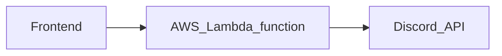

# Portfolio v2 API

1. Send an email: `POST api/v1/email` body: {name, email, message}

## Flow

```mermaid
flowchart LR
    Frontend --> AWS_Lambda_function
    AWS_Lambda_function --> Discord_API
```